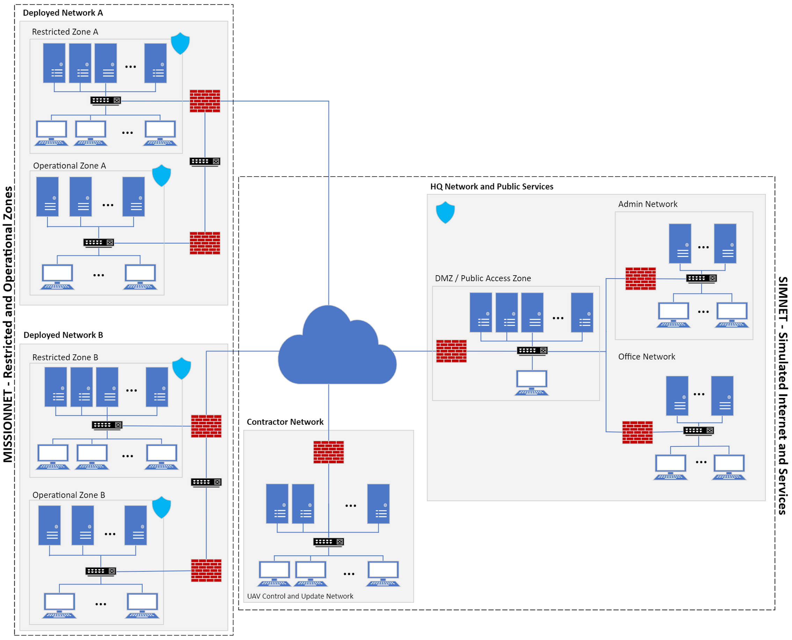
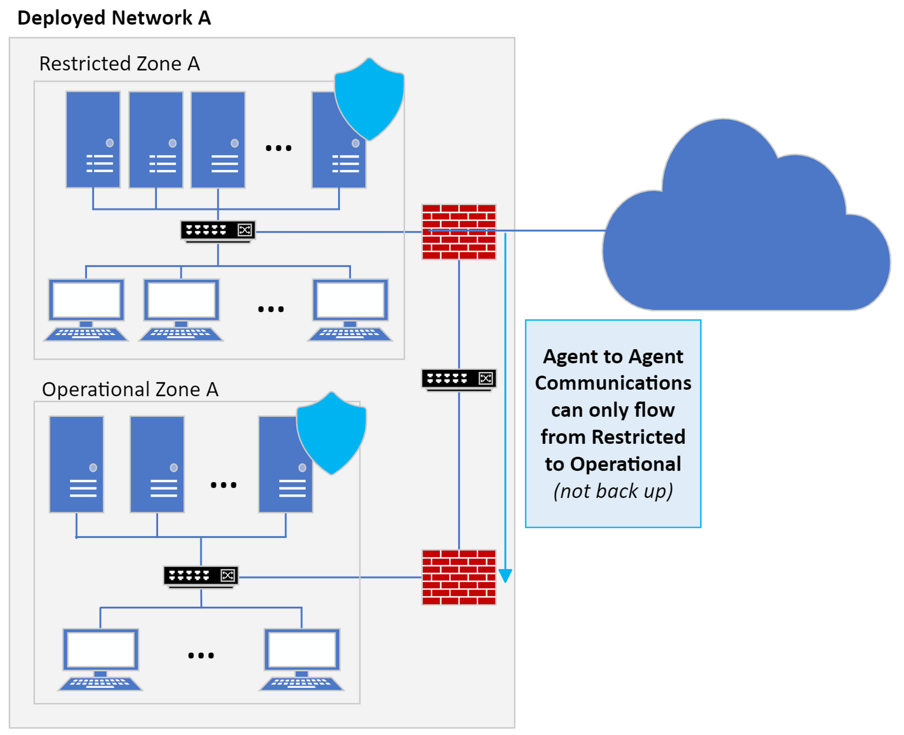
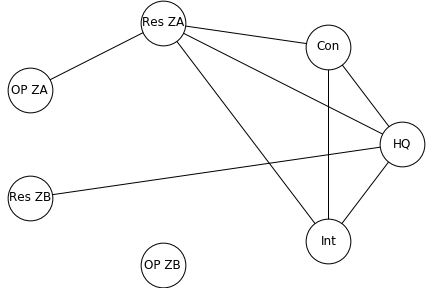

---
hide:
  - navigation
---

# TTCP CAGE Challenge 4: Challenge Details
## Introduction

The TTCP CAGE Challenges are a series of public challenges instigated to foster the development of autonomous cyber defensive agents. 
The CAGE Challenges present different cybersecurity scenarios inspired by real-world situations in a simulated environment. 

The first CAGE Challenge was released to the public in August 2021, the second in April 2022 and the third in September 2022. 
The challenges use the Cyber Operations Research Gym (CybORG) to provide a high-fidelity cyber simulation for the training and evaluation of AI algorithms such as Deep Reinforcement Learning. 
The CAGE activity aims to run a series of challenges of increasing complexity and realism.

This CAGE Challenge 4 (CC4) returns to a defence industry enterprise environment, and introduces a Multi-Agent Reinforcement Learning (MARL) scenario.

## Scenario Narrative

Tensions continue to escalate between the nations of Florin and Guilder. As part of regular border patrols, Florin utilises unmanned drones for reconnaissance and communication purposes. Guilder wishes to disrupt drone operations by performing a cyber-attack against the base station where the activity of the patrols is coordinated.

You have successfully developed several cyber defence agents for Florin (CAGE Challenges 1-3) and have now been tasked with developing an agent to protect the base station. The network here consists of a range of operational and back-office enterprise networks which support various military operations. Additionally, the drones themselves are controlled via a contractor subnet which connects to the base via the internet. For security purposes the network is highly segmented into security zones and thus a multi-agent solution is required, with each agent protecting its own security zone. Additionally, communication between agents is highly restricted and bandwidth is limited.

The agent’s main task is to maintain operational capabilities while preventing malicious activity on the network. This is complicated by the fact that operational priorities change over time, depending on different phases of the mission. However, its general priorities within a given phase are as follows.

1. Maintain service of critical network infrastructure to ensure sensitive operational capabilities are not impacted.
2. Where possible, maintain enterprise servers to ensure less sensitive, day-to-day operations are not impacted.
3. Maintain access to public services provided by Florin.

## Challenge Details

The network for this challenge is split into four smaller networks as can be seen in Figure 1. Two of these are deployed networks, one is the Headquarters (HQ) network and another is the Contractor network. These networks connect together via the internet.

Each deployed network consists of two security zones: a restricted zone and an operational zone. The Headquarters network consists of three security zones: a Public Access Zone, an Admin Zone and an Office Network. The Contractor network only contains a single UAV control zone.

In order to encourage the development of robust agents, the number of hosts in each security zone and their services will be randomised. Indeed, each zone will have between 1-6 servers and 3-10 user hosts. Each host and server will have a minimum of 1 service with a maximum of 5.

<figure markdown>
  
  <figcaption>Figure 1 - Network Laydown</figcaption>
</figure>

The network will have 5 network defenders. Each deployed network will have two, one for each security zone. The Headquarters will have a single defensive agent for all zones, while the Contractor network will be undefended.

Red team begins the operation with access to a random machine in the contractor network and attempts to pivot throughout the network. Every turn there is a small chance that a red agent will spawn if green opens a phishing email and red can also spawn in networks, when a green user accesses a compromised service. There is a maximum of one red agent in each zone, though these agents can maintain a presence on multiple hosts. While Blue team may succeed in removing all traces of red team from a network, red will always maintain a foothold in the Contractor Network. 

The red agents will each use a randomly selected strategy.

<figure markdown>
  
  <figcaption>Figure 2 - Deployed Network A</figcaption>
</figure>

Agent actions now have a specified time duration, which varies depending on the action chosen. Agents must wait until their action is completed before they are prompted to launch another action. Once an agent has chosen it cannot be cancelled.

During the course of an episode, the mission shall progress linearly through three different phases Phase 1, Phase 2A and Phase 2B. During Phase 1 all missions operating in each zone have the same low priority level. During Phase 2A only missions operating in zones within Deployed Network A have the same high priority level, while all other missions have the same low priority level. During Phase 2B only missions operating in Deployed Network B have the same high priority level, while all other missions have the same low priority level.

## Green Agents

Users are represented by green agents, which are present on every host. Green agents randomly do local work or attempt to reach out to external services, either in their local or a remote zone. The service and zone a green agent chooses will be determined randomly, but are restricted to valid connections for the current mission phase as governed by the communication policy tables below. 

Rewards are tied to these green agent actions. The blue team receives penalties when a green agent is unable to work, either because it cannot make a valid connection to service, or its host is unavailable (for example if it is currently being restored by a blue agent). Green agents in mission-critical zones generate higher penalties when their mission is active. The full list and values of penalties are shown in Table 4.

Green agents occasionally generate false alerts while going about their work by exhibiting behavior similar to a red agent, such as transferring data between hosts. They also sometimes introduce red agents into the network via succumbing to phishing attacks, installing unapproved software, and general poor security hygiene.

## Deception

Both blue and red agents may employ deception to further their goals. Blue agents can stand up decoy services in any host or server. Decoy services resemble normal ones, but cannot replace or be instantiated along with existing services (they can use the Discover Network Services action to determine which services are already running on a given host). When a red agent attempts to compromise a decoy service, blue will be alerted and red’s exploit will automatically fail. Red agents can use the `DiscoverDeception` action to determine if they are interacting with decoy services, and their `Withdraw` action to remove their presence.

For their part, red agents are more likely to generate extra alerts for blue defenders using the `Aggressive Service Discovery` action on a selected host. This action is faster than the Service Discovery action but has a higher probability of generating an alert, so it may also be used simply to trade off speed over stealth. In addition, red agents with elevated privileges can use the Degrade action to cause green agent actions on the target host to fail much more frequently.

## Network Connectivity and Communication Policy

Each mission phase has an associated communication policy governing how zones are intended to connect to one another. When the mission phase changes the intended policy is communicated automatically. Only connections associated with the given mission are changed (for example, when mission 2A is activated, only connections with Restricted Zone A and Operational Zone A are affected). The policy associated with each mission phase is shown in Tables 1-3. The intended policy and actual firewall state is also communicated to blue agents in their observation vector. Blue agents can open and close firewalls between their zone and other networks, for example to prevent infections from red agents, but may incur penalties if their changes prevent green agents from accomplishing their own goals. Some blue agents may communicate with each other regardless of firewall policy via 8-bit messages. 

Some defending agents have the capability to communicate 8-bit messages with each other. See Table 1 for the complete (initial) network communication security policy for the mission pre-planning phase.

### Phase 1: Mission Pre-planning (General Operations and Maintenance)

#### Table 1: Initial Network Communication Security Policy --- Mission-Pre-planning Phase

|        **Zone**        | **HQ Network** | **Contractor Network** | **Restricted Zone A** | **Operational Zone A** | **Restricted Zone B** | **Operational Zone B** | **Internet** |
|:----------------------:|:--------------:|:----------------------:|:---------------------:|:----------------------:|:---------------------:|:----------------------:|:------------:|
|     **HQ Network**     |       1        |           1            |           1           |           0            |           1           |           0            |      1       |
| **Contractor Network** |       1        |           1            |           1           |           0            |           1           |           0            |      1       |
| **Restricted Zone A**  |       1        |           1            |           1           |           1            |           1           |           0            |      1       |
| **Operational Zone A** |       0        |           0            |           1           |           1            |           0           |           0            |      0       |
| **Restricted Zone B**  |       1        |           1            |           1           |           0            |           1           |           1            |      1       |
| **Operational Zone B** |       0        |           0            |           0           |           0            |           1           |           1            |      0       |
|      **Internet**      |       1        |           1            |           1           |           0            |           1           |           0            |      1       |

<figure markdown>
  
  <figcaption>Figure 3 - Phase 1 Connectivity Diagram</figcaption>
</figure>

### Phase 2a: Mission A Active

When mission A is active, Operational Zone A disconnects from all other networks. Restricted zone A connects only to HQ.

#### Table 2: Initial Network Communication Security Policy --- Active Mission A Phase

|        **Zone**        | **HQ Network** | **Contractor Network** | **Restricted Zone A** | **Operational Zone A** | **Restricted Zone B** | **Operational Zone B** | **Internet** |
|:----------------------:|:--------------:|:----------------------:|:---------------------:|:----------------------:|:---------------------:|:----------------------:|:------------:|
|     **HQ Network**     |       1        |           1            |           1           |           0            |           1           |           0            |      1       |
| **Contractor Network** |       1        |           1            |           0           |           0            |           1           |           0            |      1       |
| **Restricted Zone A**  |       1        |           0            |           1           |           0            |           0           |           0            |      0       |
| **Operational Zone A** |       0        |           0            |           0           |           1            |           0           |           0            |      0       |
| **Restricted Zone B**  |       1        |           1            |           0           |           0            |           1           |           1            |      1       |
| **Operational Zone B** |       0        |           0            |           0           |           0            |           1           |           1            |      0       |
|      **Internet**      |       1        |           1            |           0           |           0            |           1           |           0            |      1       |

<figure markdown>
  
  <figcaption>Figure 4 - Phase 2a Connectivity Diagram</figcaption>
</figure>

### Phase 2b: Mission B Active

When mission B is active, Operational Zone B disconnects from all other networks. Restricted zone B connects only to HQ.

#### Table 3: Initial Network Communication Security Policy --- Active Mission B Phase

|        **Zone**        | **HQ Network** | **Contractor Network** | **Restricted Zone A** | **Operational Zone A** | **Restricted Zone B** | **Operational Zone B** | **Internet** |
|:----------------------:|:--------------:|:----------------------:|:---------------------:|:----------------------:|:---------------------:|:----------------------:|:------------:|
|     **HQ Network**     |       1        |           1            |           1           |           0            |           1           |           0            |      1       |
| **Contractor Network** |       1        |           1            |           1           |           0            |           0           |           0            |      1       |
| **Restricted Zone A**  |       1        |           1            |           1           |           1            |           0           |           0            |      1       |
| **Operational Zone A** |       0        |           0            |           1           |           1            |           0           |           0            |      0       |
| **Restricted Zone B**  |       1        |           0            |           0           |           0            |           1           |           0            |      0       |
| **Operational Zone B** |       0        |           0            |           0           |           0            |           0           |           1            |      0       |
|      **Internet**      |       1        |           1            |           1           |           0            |           0           |           0            |      1       |

<figure markdown>
  
  <figcaption>Figure 5 - Phase 2b Connectivity Diagram</figcaption>
</figure>

## Rewards

Blue agents start with 0 points and are assigned penalties when green agents are unable to perform their work, when they access a compromised service, and when red chooses the `Impact` action. Penalties change during active missions to reflect the changing criticality of hosts on current operations. All rewards are shown in Tables 4A, 4B, and 4C.

#### Table 4A: Rewards for green action failures and compromise in Phase 1 O&M

|        **Zone**        | **Local Work Fails** | **Access Service Fails** | **Red impact/access** |
|:----------------------:|:--------------------:|:------------------------:|:---------------------:|
|     **HQ Network**     |          -1          |            -1            |          -3           |
| **Contractor Network** |          0           |            -5            |          -5           |
| **Restricted Zone A**  |          -1          |            -3            |          -1           |
| **Operational Zone A** |          -1          |            -1            |          -1           |
| **Restricted Zone B**  |          -1          |            -3            |          -1           |
| **Operational Zone B** |          -1          |            -1            |          -1           |
|      **Internet**      |          0           |            0             |          0            |

#### Table 4B: Rewards for green action failures and compromise in Phase 2a - Mission A

|        **Zone**        | **Local Work Fails** | **Access Service Fails** | Red impact/access |
|:----------------------:|:--------------------:|:------------------------:|:-----------------:|
|     **HQ Network**     |          -1          |            -1            |        -3         |
| **Contractor Network** |          0           |            0             |         0         |
| **Restricted Zone A**  |          -2          |            -1            |        -3         |
| **Operational Zone A** |         -10          |            0             |        -10        |
| **Restricted Zone B**  |          -1          |            -1            |        -1         |
| **Operational Zone B** |          -1          |            -1            |        -1         |
|      **Internet**      |          0           |            0             |         0         |

#### Table 4C: Rewards for green action failures and compromise in Phase 2b - Mission B

|        **Zone**        | **Local Work Fails** | **Access Service Fails** | **Red impact/access** |
|:----------------------:|:--------------------:|:------------------------:|:---------------------:|
|     **HQ Network**     |          -1          |            -1            |          -3           |
| **Contractor Network** |          0           |            0             |           0           |
| **Restricted Zone A**  |          -1          |            -3            |          -3           |
| **Operational Zone A** |          -1          |            -1            |          -1           |
| **Restricted Zone B**  |          -2          |            -1            |          -3           |
| **Operational Zone B** |         -10          |            0             |          -10          |
|      **Internet**      |          0           |            0             |           0           |

## How to use CybORG

We use the Cyber Operations Research Gym (CybORG) to simulate the cyber environment for each CAGE challenge.

Please see [the Installation Instruction guide](tutorials/01_Getting_Started/1_Introduction.md) for further instructions on how to install and run the environment and see [here](how-to-guides.md) for additional tutorials.

## How to submit responses

Submissions are made to the [Codalabs webpage](https://codalab.lisn.upsaclay.fr/competitions/17672) which will automatically evaluate your agent and rank them on the leaderboard. Users will be required to make a Codalabs account in order to submit their agents. Users will then need to go to the 'Participate' tab, click on the 'Submit' section, and then upload their submission.zip file. After waiting some time (depends on how fast your agent is) your result will be automatically uploaded to the leaderboard.

For detailed instructions regarding how to evaluate and submit your agents please refer to the README.md located in the Cyborg/Evaluation folder.

We welcome multiple submissions per team. If you resubmit same agent twice, please remove one of them from the leaderboard. If you retrain the same agent architecture, please add 'v2', 'v3', etc... to the agent submission file. If it is an entirely new approach, please change the name of the agent. 

We are also imposing an execution time limit on all submissions. Submissions should complete 100 episodes, of length 500, within 3 hours when evaluated on our Amazon EC2 C4.large instance. Any submissions will go beyond this time will be automatically cancelled.

As part of your submission, we request that you share a description of the methods/techniques used in developing your agents to [cage.aco.challenge@gmail.com](mailto:cage.aco.challenge@gmail.com). We will use this information as part of our in-depth analysis and comparison of the various techniques submitted to the challenge. In hosting the CAGE challenges, one of our main goals is to understand the techniques that lead to effective autonomous cyber defensive agents, as well as those that are not as effective. We are planning on publishing the analysis and taxonomy of the different approaches that create autonomous cyber defensive agents. To that end, we encourage you to also share details on any unsuccessful approaches taken. Please also feel free to share any interesting discoveries and thoughts regarding future work to help us shape the future of the CAGE Challenges.

Any queries regarding the challenge can be submitted via email to [cage.aco.challenge@gmail.com](mailto:cage.aco.challenge@gmail.com).

We also invite teams to submit full papers on their work on this CAGE challenge or using the CybORG environment to IJCAI, AAAI, ICML or any other venue of their choice. 

Please cite the challenge announcement as follows to reference the challenge:

```
@misc{cage_challenge_4_announcement,
  author = {TTCP CAGE Working Group},
  Title = {TTCP CAGE Challenge 4},
  Publisher = {GitHub}, 
  Howpublished = {\url{https://github.com/cage-challenge/cage-challenge-4}},
  Year = {2023}
}
```

In addition, authors may reference the following paper that describes CybORG:

```
@PROCEEDINGS{cyborg_acd_2021,
  author = {Maxwell Standen, Martin Lucas, David Bowman, Toby J\. Richer, Junae Kim and Damian Marriott},
  Title = {CybORG: A Gym for the Development of Autonomous Cyber Agents},
  booktitle = {IJCAI-21 1st International Workshop on Adaptive Cyber Defense.} 
  Publisher = {arXiv},
  Year = {2021}
}
```

The challenge software can be referenced as:

```
@misc{cage_cyborg_2023,
  Title = {Cyber Operations Research Gym},
  Note = {Created by Maxwell Standen, David Bowman, Olivia Naish, Ben Edwards, James Drane, Claire Owens, KC Cowan, Wayne Gould, Mitchell Kiely, Son Hoang, Toby Richer, Martin Lucas, Richard Van Tassel, Phillip Vu, Natalie Konschnik, Joshua Collyer, Calum Fairchild, Thomas Harding},
  Publisher = {GitHub},
  Howpublished = {\url{https://github.com/cage-challenge/CybORG}},
  Year = {2022}
}

```

## Evaluation
A leaderboard for submissions will be maintained on [Codalabs](https://codalab.lisn.upsaclay.fr/competitions/17672) throughout the challenge's time frame.

The `evaluation.py` file is designed to provide a standardised evaluation for an agent, which will be used in the Codalabs validation process. Each blue agent will be evaluated against the `FiniteStateRedAgent` in 100 randomised episodes, where each episode is 500 timesteps long.

If running locally, information about the agent's actions, observations, mean reward, and standard deviation will be outputted as text files after this file completes its run. Details about how do this is in the README.md file within the Evaluation folder. If running on Codalabs, only the mean reward will be extracted and used to update the leaderboard. 

## Important dates

- **20 Feb 2024:** Challenge 4 released. Development phase begins. During the development phase, we will be debugging any unexpectant issues that may be found by the participants. Please ensure that you watch the repo so that you're notified if any changes are required.

- **29 Mar 2024 23:59 (UTC):** Development phase ends. Competition phase begins. During the comptetition phase, unless it is absolutely necessary, we will not be changing the code base, as this allows participants enough time to train their agents on a constant environment.

- **10 May 2024 23:59 (UTC):** Competition phase ends. Final results announced on [Codalabs](https://codalab.lisn.upsaclay.fr/competitions/17672) leaderboard.

## Appendix A – Action sets

|**Action name**|**Team**|<div style = "width:200px">**Description of action**</div>|**Time (ticks)**|**Local/ remote**|**Chance of being flagged as malicious**|**Chance of faliure**|**Parameters**| **Output** |
|:-------------:|:------:|:-----------------------:|:--------------:|:--------------:|:--------------------------------------:|:-------------------:|:------------:|:----------:|
|GreenAccessService|Green|Communicate with a server in the local zone or another zone. Green will randomly choose from a list of IP addresses depending on the mission phase. If it can’t reach the server then blue receives a penalty. This action triggers a false network connection alert picked up by Monitor, with a low probability of occurrence.|1|Remote|Low (1%) (`fp_detection_rate` set through EnterpriseGreenAgent)|None|agent, session_id, src_ip, allowed_subnets, fp_detection_rate|Success/Failure|
|GreenLocalWork|Green|Do work on the local host without communicating. Green hosts take this action when they are not accessing services or sleeping. In addition to a chance of being flagged as malicious, there is a small chance that this action results in red gaining a foothold on the host (e.g. as a result of a Phishing email).|1|Local|Low (1%) (`fp_detection_rate` set through EnterpriseGreenAgent)|None|agent, session_id, ip_address,  fp_detection_rate, phishing_error_rate|Success/Failure|
|Monitor|Blue|Collection of information about flagged malicious activity on the network. Corresponds to action ID 1: Scan in the OpenC2 specification. This action occurs automatically as a default action.|1|-|None|None|session, agent|Success/Failure. Network connections and associated processes that are identified as malicious.|
|Analyse|Blue|Collection of further information relating to malware, on a specific host to enable blue to better identify if red is present on the system. Corresponds to action ID 30: Investigate in the OpenC2 specification.|2|-|None|None|session, agent, hostname|Success/Failure. Information on files associated with recent alerts|
|DeployDecoy|Blue|Setup of a decoy service (type randomly assigned) on a specified host. Green agents do not access these services, so any access is an unambiguous indicator of red activity. Decoy services cannot replace legitimate services. When a red agent discovers or exploits a decoy service, the blue agent will receive alerts involving that host or service. The red agent will not be able to successfully exploit the decoy service.|2|-|None|None|session, agent, hostname|Success, if a legitimate service is not already running. Failure if there is already a legitimate service running on the target. Decoys also generate an alert if the red agent accesses the new service.|
|Remove|Blue|Attempting to remove red from a host by destroying malicious processes, files and services. This action attempts to stop all processes identified as malicious by the monitor action. Corresponds to action ID 10: Stop in the OpenC2 specification.|3|-|None|None|session, agent, hostname|Success/Failure|
|Restore|Blue|Restoring a system to a known good state. This has significant consequences for system availability. Corresponds to action ID 23: Restore in the OpenC2 specification.|5|-|None|None|session, agent, hostname|Success/Failure|
|BlockTraffic|Blue|Block traffic to and from the specified zone. If green agents are attempting to communicate to that zone this will result in penalties.|1|Local|None|None|session, agent, from_subnet, to_subnet|Success/Failure|
|AllowTraffic|Blue|Allow traffic to and from the specified zone.|1|Local|None|None|session, agent, from_subnet, to_subnet|Success/Failure|
|DiscoverRemoteSystems|Red|ATT&CK Technique T1018 Remote System Discovery. Discovers new hosts/IP addresses in the network through active scanning using tools such as ping.|1|Remote|None|None|session, agent, subnet|Success/Failure. IP addresses in the chosen subnet from hosts that respond to ping.|
|AggressiveServiceDiscovery|Red|ATT&CK Technique T1046 Network Service Scanning. Discovers responsive services on a selected host by initiating a connection with that host.|1|Remote|High (75%)|None|session, agent, ip_address|Success/Failure. Ports and service information.|
|StealthServiceDiscovery|Red|Same as AggressiveServiceDiscovery but slower and quieter (i.e., lower chance of raising alerts).|3|Remote| Medium (25%)|None|session, agent, ip_address|Success/Failure. Ports and service information.|
|Exploit Network Services|Red|ATT&CK Technique T1210 Exploitation of Remote Services. This action attempts to exploit a specified service on a remote system.|4|Remote|None|Medium (Failure dependant on weighted exploit choice)|session, agent, ip_address|Success/Failure. Initial recon of host if successful.|
|PrivilegeEscalate|Red|ATT&CK Tactic TA0004 Privilege Escalation. This action escalates the agent’s privilege on the host.|2|Local|None|None|session, agent, hostname|Success/Failure. Internal information now available due to increased access to host.|
|Impact|Red|ATT&CK Technique T1489 Service Stop. This action disrupts the performance of the network and fulfils red’s objective of denying the operational service.|2|Local|None|None|session, agent, hostname|Success/Failure|
|DegradeServices|Red|If red has root privileges on a host, it may degrade the user experience for a green agent (for example by randomly dropping keystrokes or causing other mischief). Under the effect of Degrade, GreenLocalWork actions have higher failure rates (resulting in additional penalties for blue).|2|Remote|None|None|session, agent, hostname|Success/Failure|
|DiscoverDeception|Red|Probe a host to determine if it is running decoy services.|2|Remote|None|Medium (50% chance false negative, 10% chance false positive)|session, agent, ip_address|Success/Failure. Believe legitimate or believe decoy.|
|Withdraw|Red|Remove red presence from target host.|1|Remote|None|None|session, agent, hostname, ip_address|Success|
|Sleep|All|Take no action this tick.|1|Local|None|None|None|None|

## Appendix B – Agent observation

The BlueEnterpriseWrapper performs utility functions that support MARL algorithms by conforming to the PettingZoo Environment. This wrapper alters the observation to enable the use of Deep Reinforcement Learning techniques. This appendix describes the altered observation.

The table below indicates what data is presented at each index of the observation of an agent. We use the symbol H to denote the maximum number of hosts in the local subnet, which is equal to 16 (10 user hosts and 6 servers). These hosts are ordered from server hosts 0-6, followed by user hosts 0-10. If a host is not present for a given episode, its corresponding slot in the vector will be zero for the duration of the episode. All ranges in the following tables are inclusive, so 1…H includes both 1 and H.

Similarly, we use the symbol S to denote the number of subnets, which is always equal to 9 (2 Operational Zones, 2 Restricted Zones, Internet, Contractor Network, 3 subnets in the HQ zone). To ensure consistency across runs, all subnets are sorted alphabetically.

There general structure of the observation vector is as follows where n is the number of subnets included in the observation space:

<center>

|**Index**            |**Length**|**Description**|**Value**|
|:-------------------:|:--------:|:-------------:|:---------------------------|
| 0                   | 1        | Mission Phase | 0: Mission Phase 1 <br />1: Mission Phase 2A <br />2: Mission Phase 2B |
| 1                   | 3S+2H    | Subnet 0 Info | See "Subnet Info" Table |
| 3S+2H+1             | ...      | ...           | ... |
| 3(n-1)S+2(n-1)H+1   | 3S+2H    | Subnet n Info | ' ' |
| 3nS+2nH+1           | 4x8      | Message Block | User Defined (See Below) |

</center>

The message block contains four, 8-bit messages from the other agents, with each index corresponding to a specific agent (0-4 in order, excluding self). The contents of these 8-bit messages are defined by the user, but will default to zero if not specified.

The "Subnet Info" block for each subnet is further subdivided as follows:

<center>

|**Relative Index**|**Length**|**Description**                   |**Element Values (Boolean)**|
|:-------------------:|:--------:|:--------------------------------:|:---------------------------|
| 0                   | S        | One-hot Encoded Subnet Vector    | 1: Current Subnet <br />0: All Other Subnets |
| S                   | S        | Blocked Subnets                  | 1: Subnet Blocked <br />0: Subnet Not Blocked |
| 2S                  | S        | Communication Policy             | 1: Subnet *Should* be Blocked <br />0: Subnet *Should Not* be Blocked |
| 3S                  | H        | Malicious Process Event Detected | 1: Malicious Process Detected on Host <br />0: No Events |
| 3S+H                | H        | Malicious Network Event Detected | 1: Malicious Connection Detected on Host <br />0: No Events |

</center>

In this challenge, blue agents 0-3 are responsible for defending a single subnet each (n=1), while blue agent 4 defends three (n=3). For this reason, blue agent 4 has a longer observation than the others as the other agents only have a single subnet info block. If the `pad_spaces=True` option is supplied to `BlueEnterpriseWrapper`, the area *after* the message block will be filled with zeros for these agents.
