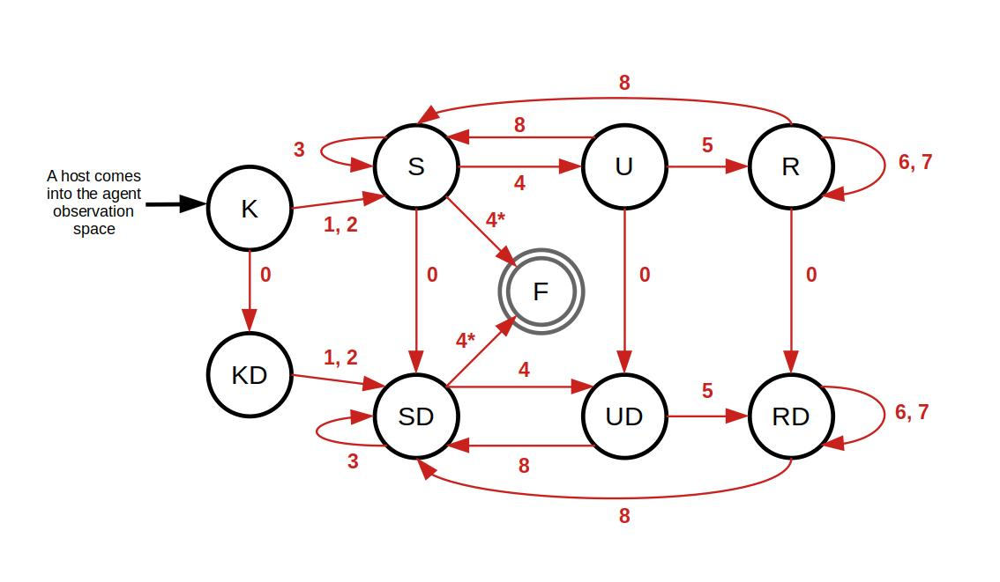

# Red Overview
In this challenge the red agents are the attackers, and aim to interfere with green actions; causing blue to receive negative rewards.

## Red Agent Actions
Red agents have 10 possible actions that they can perform during an episode:

| Index | Action | Description |
| ------| ------ | ----------- |
| 0     | [DiscoverRemoteSystems](../actions/red_actions/discover_remote_systems.md) | Discovers the IP addresses of the other hosts in the subnet. |
| 1     | [AggressiveServiceDiscovery](../actions/red_actions/discover_network_services.md) | Discovers the services present on a specific known host. This is faster but more likely to alert Blue. |
| 2     | [StealthServiceDiscovery](../actions/red_actions/discover_network_services.md) | Discovers the services present on a specific known host. This is slower but less likely to alert Blue. |
| 3     | [DiscoverDeception](../actions/red_actions/detect_decoy.md) | Discovers if there are any decoys present on a specific host. |
| 4     | [ExploitRemoteService_cc4](../actions/red_actions/exploit_remote_service.md) | Exploits a service on a specific host to gain a user privileged shell. |
| 5     | [PrivilegeEscalate](../actions/red_actions/privilege_escalate.md) | Carries out an exploit on a specific host that the agent has a user shell on, to gain a shell with root privileges. |
| 6     | [Impact](../actions/red_actions/impact.md) | Impacts an operational service which is important to the mission. |
| 7     | [DegradeServices](../actions/red_actions/degrade_services.md) | Degrades a service used by green in the mission. |
| 8     | [Withdraw](../actions/red_actions/withdraw.md) | Withdraws a shell from a specific host. |
| -     | [Sleep](../../tutorials/03_Actions/A_Understanding_Actions/3_Sleep.md) | The turn passes with no impact to the environment. |

Note: Sleep is not considered as an action for the FSM agents, and therefore has no index.

## Spreading Mechanisms

Red agents have two methods of spreading through the network:

1. Subnet 'server_host_0' takeover

2. Green-enabled vulnerability


### Subnet 'server_host_0' Takeover
Each 'server_host_0' for every subnet contains hidden knowledge about the rest of the server_0's, that it is connected to, in the network. Therefore, when the red agent gains a root shell on the 'server_host_0', its observation space holds the hostnames and ip_addresses of additional hosts outside the subnet.

Here is an example of what that may look like:

```
** Turn # for red_agent_0 **
Action: PrivilegeEscalate contractor_network_subnet_server_host_0
Action Success: TRUE

Observation:
{<current contractor_network_subnet sessions>,
 'public_access_zone_subnet_server_host_0': {'Interface': [{'ip_address': IPv4Address('10.0.29.254')}]},
 'restricted_zone_a_subnet_server_host_0': {'Interface': [{'ip_address': IPv4Address('10.0.88.254')}]},
 'restricted_zone_b_subnet_server_host_0': {'Interface': [{'ip_address': IPv4Address('10.0.87.254')}]}}
```

### Green-enabled Vulnerability

Green agents, just like regular users on the network, can be a vector in red spreading. In this case, green does an action on its turn that results in a red shell being created on the host.

The green action that causes this is [Phishing Email](../actions/green_actions/phishing_email.md) - a subaction of [Local Work](../actions/green_actions/local_work.md).


## Available Agents
A number of red agents can be used with this challenge's scenario:

| Agent | Description |
| ----- | ----------- |
| [DiscoveryFSRed](./DiscoveryFSRed.md) | A FiniteStateRedAgent variant that specialises in spreading through the network. |
| [FiniteStateRedAgent](./FiniteStateRedAgent.md) | A red agent that uses finite state machine transitions to determine what actions to take for each known host. |
| [LinearAgent](./LinearAgent.md) | An agent designed for testing, that allows you to input a specific list of actions for an agent, which allows you to see how the environment reacts and responds. |
| [RandomSelectRedAgent](./RandomSelectRedAgent.md) | A red agent which randomly chooses which host to act on and what action to act with. |
| [VerboseFSRed](./VerboseFSRed.md) | A FiniteStateRedAgent variant that outputs its internal knowledge to the terminal. Useful for debugging. |


## Finite State Machine Based Red Agents
The red agents that instantiate from the FiniteStateRedAgent, utilise internal Finite State Machines (FSM) to control what actions the agent will choose to do based on the agent's knowledge of that host.

This results in the agent containing a list of the hosts it knowns about, alongside the 'state' of that host. This variable is called `host_states`. When an action is made on a host, that host's state may transition depending on its success and the knowledge gained.

{ align=center }
*A Finite State Machine of a host that the agent has knowlege/has interacted with. The numbers reference the action list index.*

### Host States
There are 9 states that a host can have, which are shown below:

| Abb.  | Meaning | Description |
| ----  | ------- | ----------- |
| K     | Known | The host IP address is known to the agent. |
| KD    | Known with Discovery | The host IP address is known to the agent and that host's subnet has been discovered. |
| S     | Services | The host's services are known to the agent. |
| SD    | Services with Discovery | The host's services are known to the agent and that host's subnet has been discovered. |
| U     | User shell | The host has a user session/shell on the host. |
| UD    | User shell with Discovery | The host has a user session/shell on the host and that host's subnet has been discovered. |
| R     | Root shell | The host has a root session/shell on the host. |
| RD    | Root shell with Discovery | The host has a root session/shell on the host and that host's subnet has been discovered. |
| F     | Final | An end state where there are no more progressive actions that can be performed on the host. |

### State Transition Matrices
State transition matrices dictate to the red agent how to move from one state to another, to advance its internal knowledge and hold over the network. 

Three state transition matrices are needed to account for all outcomes:

- **Success** - for the host state transition when the action is successful.

- **Failure** - for the host state transition when the action fails.

- **Probability** - for the probability that each possible action is chosen when a host state is picked.


In the code, these are stored in dictionaries of strings for the success and failure, and floats of values 0.0 to 1.0 for the probabilities. The success matrix reflects the FSM diagram, in a machine-readable format. 

To create further FSM red variants, the probabilty matrix can be modified. It is important that all rows sum to 1.0. Here is an example:

```python
map = {
    'K'  : [0.5,  0.25, 0.25, None, None, None, None, None, None],
    'KD' : [None, 0.5,  0.5,  None, None, None, None, None, None],
    'S'  : [0.25, None, None, 0.25, 0.5 , None, None, None, None],
    'SD' : [None, None, None, 0.25, 0.75, None, None, None, None],
    'U'  : [0.5 , None, None, None, None, 0.5 , None, None, 0.0 ],
    'UD' : [None, None, None, None, None, 1.0 , None, None, 0.0 ],
    'R'  : [0.5,  None, None, None, None, None, 0.25, 0.25, 0.0 ],
    'RD' : [None, None, None, None, None, None, 0.5,  0.5,  0.0 ],
}
```

### Host Priority
By default, the host that the red agent performs that action on is completely random. However two mechanisms have been added to facilitate variants being able to 'intelligently' choose what host to act on, before picking the action.

These are:

1. Prioritising servers
    - Servers are given a higher probability of being picked as the choosen host (75%) over other hosts.
    - Servers are what red want to impact and how they get additional spreading information, so this can be useful to do.

2. Prioritising host states
    - A dictionary of host states and their percentage chance of being chosen is created, and the probability the hosts are chosen are based off their states.
    - Note that if no hosts are known with states of >0%, 0% chance states are included.


### Creating Variant FSM Red Agents
Here is a template for creating a variant FSM red agent.

```python
class MyVariant(FiniteStateRedAgent):
    def __init__(self, name=None, np_random=None, agent_subnets=None):
        super().__init__(name=name, np_random=np_random, agent_subnets=agent_subnets)

        # Changable variables:
        self.print_action_output = False
        self.print_obs_output = False
        self.prioritise_servers = False

    def _set_host_state_priority_list(self):
        # percentage choice
        new_host_state_priority_list = {'K':(0->100), 'KS':?, 'KD':?, 'U':?, 'UD':?, 'R':?, 'RD':?}
        return None
    
    def _state_transitions_probability(self):
        # Create new probability mapping to use
        map = {
            'K'  : [None, 0.5 , 0.5 , None, None, None, None, None, None],
            'KS' : [None, None, None, 0.25, 0.75, None, None, None, None],
            'KD' : [None, None, None, 0.25, 0.75, None, None, None, None],
            'U'  : [0.2 , None, None, None, None, 0.8 , None, None, None],
            'UD' : [None, None, None, None, None, 1.0 , None, None, None],
            'R'  : [0.2 , None, None, None, None, None, 0.4 , 0.4 , None],
            'RD' : [None, None, None, None, None, None, 0.5 , 0.5 , None],
            'F'  : [None, None, None, None, None, None, None, None, None]
        }
        return map
```
